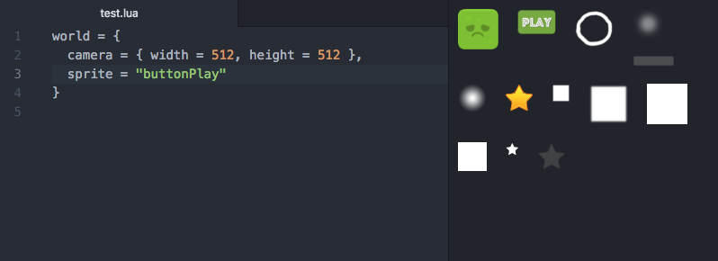

# sprite-picker package

sprite-picker is an atom plugin I use in my hobby game projects
as a visual way to pick one from available sprites. All images in
assets/sprites folder are listed as thumbnails in a side panel. The panel
can be opened with a hotkey or by placing the cursor on a string that contains
the name of one of the available images. Clicking on an image inserts/replaces
the name of the image in the text.

